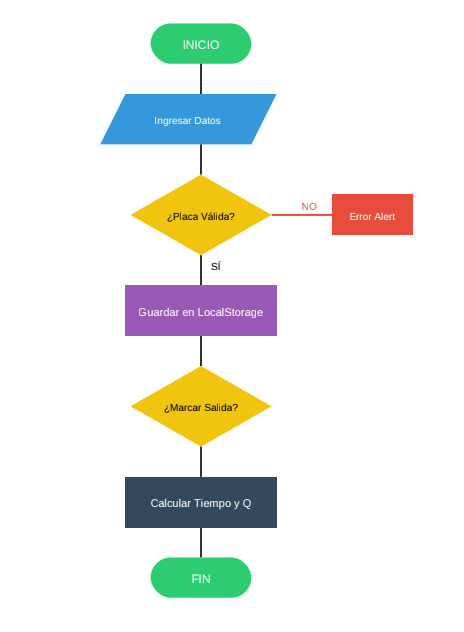

## Descripción del Proyecto
Campus Parking es una aplicación web diseñada para automatizar la gestión de un
estacionamiento, asegurando el cumplimiento de formatos de placa y cálculos
precisos de cobro por tiempo transcurrido.

## DIAGRAMA DE FLUJO

## Estructura de Archivos

### archivosCSS
* **animacion.css**: Gestiona las transiciones y efectos visuales de la interfaz.
* **formulario.css**: Define el diseño y estilos de los campos de entrada de datos.
* **login.css**: Estilos específicos para la página de inicio de sesión.
* **nuevo.css**: Hoja de estilos principal para la gestión de registros y el home.
* **responsive.css**: Ajustes para que la aplicación sea compatible con dispositivos móviles.

### moduloJAVASCRIPT
* **api.js**: Contiene la lógica para conectar con la API de clima y mostrar datos en tiempo real.
* **componentes-tipo.js**: Maneja la configuración de tipos de vehículos y sus tarifas.
* **login.js**: Controla la validación de usuarios y el acceso al sistema.
* **nuevo.js**: Lógica principal del parqueo (Ingresos, Salidas, CRUD y LocalStorage).

### Documentos HTML y Otros
* **index.html**: Página de inicio (Login).
* **home.html**: Panel de control principal del parqueo.
* **historial.html**: Visualización de bitácoras y registros de salidas.
* **registros.html**: Módulo de administración de tarifas y tipos de vehículos.
* **.gitignore**: Archivo de configuración para excluir archivos innecesarios en el repositorio.
* **README.md**: Documentación general del proyecto.

# Campus Parking 
Sistema de gestión de estacionamiento desarrollado para el
control de ingreso, salida y cobro de vehículos en tiempo

## Funcionalidades
- **Gestión de Vehículos**: Registro de entrada con validación
de placa (3 letras y 3 números).
- **Control de Espacios**: Visualización interactiva de 10
espacios (Libre/Ocupado).
- **Cálculo Automático**: Cobro basado en tipos de vehículos
configurables y tiempo de estancia.
- **Historial y Registros**: Bitácora completa de movimientos
y gestión (CRUD) de tarifas.
- **Perfil de Usuario**: Edición de datos del administrador.

## Tecnologías
- HTML / CSS
- JavaScript 
## Reglas de Negocio Implementadas
1. **Formato de Placa**: Solo se aceptan placas con el formato
`AAA123`.
2. **Validación de Tiempo**: No se permite marcar salida si la
hora es anterior a la de entrada.
3. **Persistencia**: Todos los datos se almacenan en el
navegador mediante `localStorage`.

---
Desarrollado por **Sergio Ajú** - Guatemala 2026.